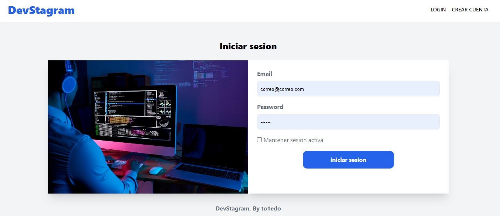
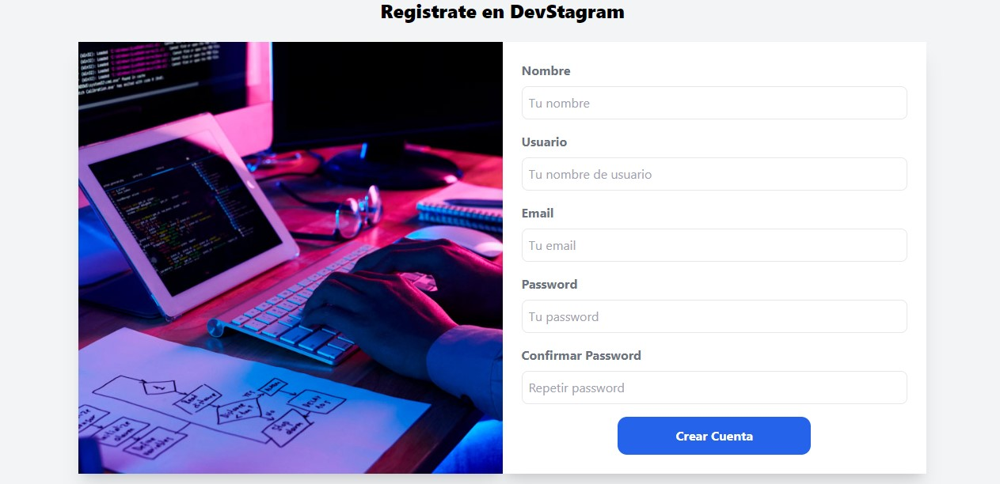
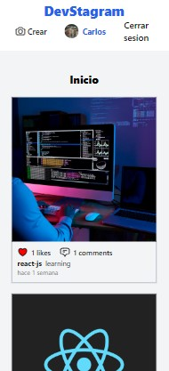
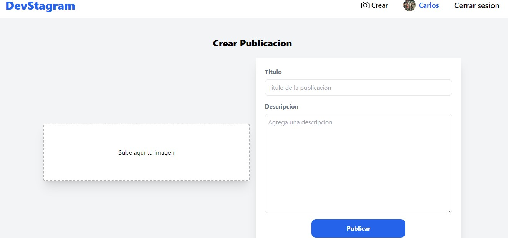
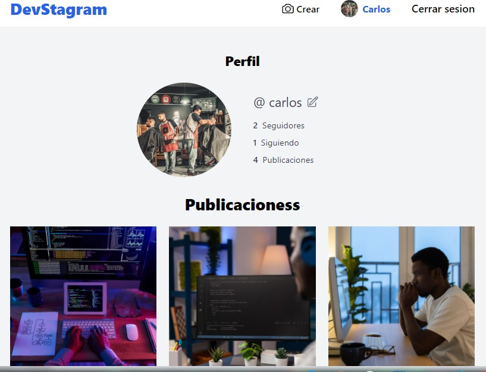
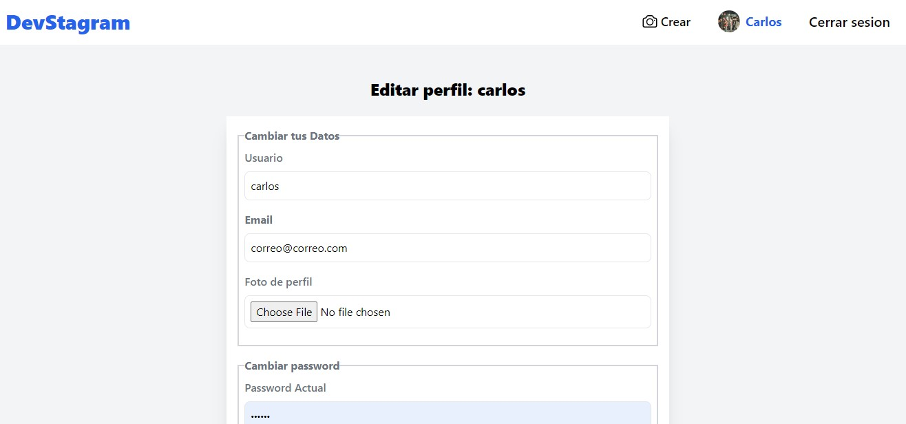
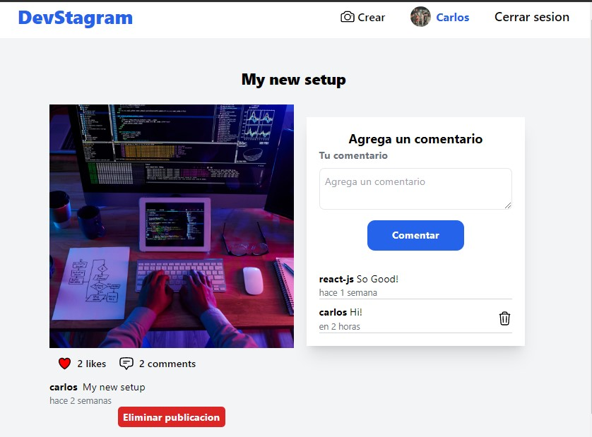

<h1>Devstagram</h1>

Devstagram en una plataforma inspirada en la red solcial Instagram, donde personas que se dediquen al desarrollo de sofware pueden compartir publicaiones diarias.

User para pruebas:
correo@correo.com
correo3@correo.com
prueba@gmail.com

password: 123456

<h2>La aplicación Web posee las siguentes características:</h2>

<ul>
  <li>
    Panel de autenticación para el Login:
    
  </li>

  

  <li>
    Panel para crear cuenta:
    
  </li>
  
  

  <li>
    Página de inicio donde se muentran las publicaiones de las personas que sigues:
     
    
  </li>

  

  <li>
    Página para creación de tus publicaciones:
    
    
    Para este apartado se utilizó la librería de Dropzone, la cual permite realizar la subida de archivos de manera más interactiva y visual.
    
  </li>

  

  <li>
    Página de perfil personal:
    
    
    En este apartado la persona puede agregar una foto de perfil y ver todas las publicaiones que ha realizado

  </li>

  

  <li>
    Página para editar perfil personal:
    
    
    En este apartado la persona puede agregar una foto de perfil, cambiar el password e email
  </li>

  

  <li>
    Página para ver una publicación:
    

    En este apartado, las personas pueden a detalla la publicación seleccionada, además, pueden agragar comentarios y dar likes, teniendo validaciones para que solo las personas autenticadas puedan hacerlo.
    
    A los autores de los comentarios les aparecerá la opción de eliminar sus comentarios.

    Para estos apartados se hizo uso de LiveWire para realizar las peticiones y actualizacion de los valores en tiempo real y sin necesidad de recargar la página.
  </li>
  
</ul>

<h2>Base de datos:</h2>

La base de datos utilizada fue SQL y se usa el ORM Eloquent de Laravel para interactuar esta

A continuación el diagrama de realacines de las tablas utilizadas para la aplicación:

en el futuro pienso seguir agregando nuevas características, como  verificacion de email, buscadores y notificaciones push